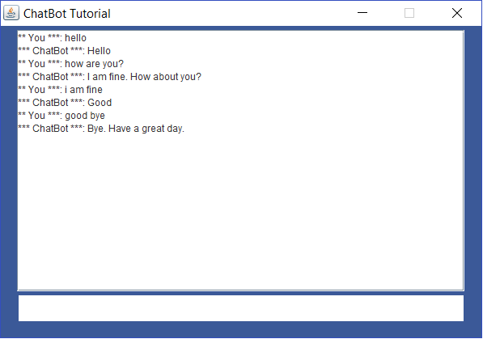

# ChatBotJava

A simple Chatbot (Nothing fancy) application using Java Swing.
**App** class which calls **ChatDialog** class to create the UI.
**AI** class will parse the input data and return the output on the screen.

Following is the simple UI for the application.

Reference: 
* [Chat Bot Tutorial](https://www.youtube.com/watch?v=a8RUmnPL8aQ&t=119s)
